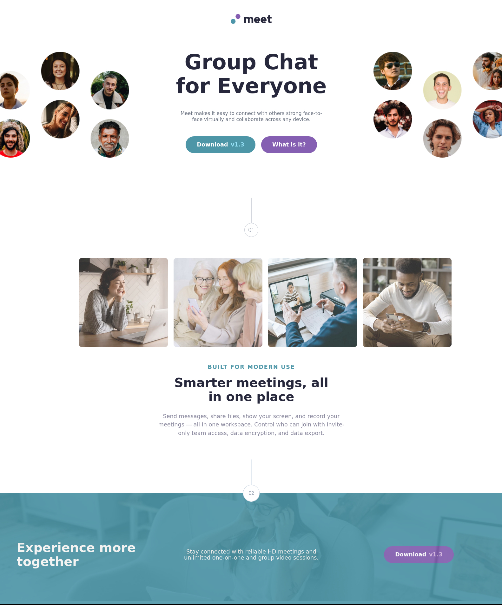

# Frontend Mentor - Meet landing page solution

This is a solution to the [Meet landing page challenge on Frontend Mentor](https://www.frontendmentor.io/challenges/meet-landing-page-rbTDS6OUR). Frontend Mentor challenges help you improve your coding skills by building realistic projects.

## Table of contents

- [Overview](#overview)
  - [The challenge](#the-challenge)
  - [Screenshot](#screenshot)
  - [Links](#links)
- [My process](#my-process)
  - [Built with](#built-with)
  - [What I learned](#what-i-learned)
  - [Continued development](#continued-development)
  - [Useful resources](#useful-resources)
- [Author](#author)
- [Acknowledgments](#acknowledgments)

## Overview

### The challenge

Users should be able to:

- View the optimal layout depending on their device's screen size
- See hover states for interactive elements

### Screenshot



### Links

- Solution URL: [Add solution URL here](https://github.com/ttsoares/meet-landing-page)
- Live Site URL: [Add live site URL here](https://meeting-page--z0yqm6fp07.expo.app)

## My process

### Built with

- React Native tags
- TailwindCSS custom colors and fonts
- Web-first workflow
- Typescript
- [React Native](https://reactnative.dev/) - JS framework.
- [Nativewind](https://www.nativewind.dev) - TailwindCSS for React Native.
- [Expo Go](https://expo.dev/) - Universal native apps with React that run on Android, iOS, and the web.

### What I learned

There are several sutil differences while coding with React Native from regular React. Plus, styling with Nativewind add a new layer of novelty for me.

```jsx
return (
  <View className="flex-1">
    <ImageBackground
      source={imageSrc}
      className="h-[380px] md:h-[330px] lg:h-[320px]"
    >
      <View className="h-12 w-12 rounded-full border border-slate-300 items-center justify-center bg-white absolute -top-6 left-1/2 -translate-x-1/2 z-10">
        <Text className="text-slate-500 font-medium">02</Text>
      </View>
    </ImageBackground>
  </View>
);
```

### Continued development

As yet a novice about React it is a serious challenge to write good code in general... with extra weight to drag that is the deploiment of IOs, Android and Web applications. Moving from Ionic now I'll pursue deep intimacy with this context of React Native and Expo Go.

With the help of the Expo Go framework several benefits of NextJS are available for React Native.
The next challenge will be more that just a landing page...

### Useful resources

- [Expo Go](https://www.youtube.com/watch?v=XgWENEf3oFw&list=PLC3y8-rFHvwgVmqbtQkPDxkvDf6w5_eGA) - Frontend Made Easy.
- [Nativewind](https://www.nativewind.dev/getting-started/installation) - Documentation.

## Author

- Website - [Thomas TS](https://buildesign.vercel.app/)
- Frontend Mentor - [@ttsoares](https://www.frontendmentor.io/profile/ttsoares)
- Linkedin - [thomas-soares-6791781b/](https://www.linkedin.com/in/thomas-soares-6791781b/)

## Acknowledgments

Countless hours learning from several on Youtube and StackOverflow, specially Wishwas from @Codevolution.
The AI in my IDE: Windsurf.
